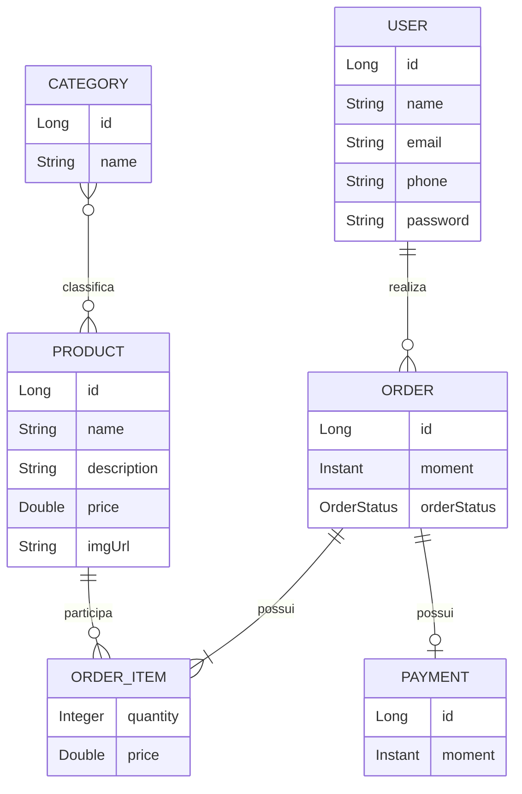

# Workshop Spring Boot JPA

API REST desenvolvida em **Java com Spring Boot e Spring Data JPA**, utilizando Hibernate para o mapeamento objeto-relacional e banco de dados H2 para o ambiente de testes.

O projeto simula uma aplicação de vendas, com funcionalidades relacionadas ao gerenciamento de usuários, produtos, categorias e pedidos.

## 🚀 Tecnologias utilizadas

* Java 25
* Spring Boot
* Spring Web
* Spring Data JPA
* Hibernate
* H2 Database
* PostgreSQL
* Maven

## 📋 Funcionalidades

O projeto implementa uma API REST organizada em camadas e contempla funcionalidades como:

* Consulta de usuários
* Cadastro, atualização e remoção de usuários
* Consulta de produtos
* Consulta de categorias
* Consulta de pedidos
* Persistência de dados utilizando JPA/Hibernate
* Relacionamentos entre entidades
* Carregamento inicial de dados para testes
* Tratamento de exceções
* Utilização de diferentes perfis de configuração

## 🏗️ Arquitetura

A aplicação utiliza uma arquitetura organizada em camadas, separando as responsabilidades de cada parte do sistema.

```text
src/main/java/com/educandoweb/course/

├── config/
│
├── entities/
│   ├── enums/
│   └── pk/
│
├── repositories/
│
├── resources/
│   └── exceptions/
│
└── services/
    └── exceptions/
```

### Camadas principais

**Entities**

Contém as entidades que representam os objetos do domínio e que são mapeadas para o banco de dados através do JPA.

**Repositories**

Responsáveis pelo acesso e persistência dos dados, utilizando os recursos disponibilizados pelo Spring Data JPA.

**Services**

Concentram regras e operações relacionadas ao domínio da aplicação, fazendo a comunicação entre os controllers e os repositories.

**Resources**

Contêm os endpoints da API REST e são responsáveis por receber as requisições HTTP e retornar as respostas.

**Config**

Reúne configurações da aplicação, incluindo a inicialização de dados utilizados no ambiente de testes.

## 🧩 Modelo de domínio

O sistema possui um modelo de domínio composto pelas entidades `User`, `Order`, `OrderItem`, `Product`, `Category` e `Payment`.

Essas entidades se relacionam para representar usuários realizando pedidos, pedidos contendo produtos e pagamentos associados às compras.

### 🔗 Relacionamentos



### 📌 Principais associações

| Relacionamento          | Cardinalidade | Descrição                                                         |
| ----------------------- | :-----------: | ----------------------------------------------------------------- |
| `User` → `Order`        |     `1:N`     | Um usuário pode possuir vários pedidos.                           |
| `Order` → `OrderItem`   |     `1:N`     | Um pedido pode possuir vários itens.                              |
| `Product` → `OrderItem` |     `1:N`     | Um produto pode aparecer em vários itens de pedidos.              |
| `Product` ↔ `Category`  |     `N:N`     | Produtos podem estar associados a várias categorias e vice-versa. |
| `Order` → `Payment`     |     `1:1`     | Um pedido possui uma associação com um pagamento.                 |

### 🛒 OrderItem

A entidade `OrderItem` representa a participação de um produto dentro de um determinado pedido.

Ela é utilizada porque a relação entre pedidos e produtos possui informações próprias. Além de identificar o pedido e o produto envolvidos, o item registra dados como:

* quantidade;
* preço do produto no momento da compra.

Assim, em vez de manter apenas uma relação direta entre `Order` e `Product`, o sistema utiliza `OrderItem` para representar cada item individual de um pedido.

```text
Order
  │
  │ 1:N
  ▼
OrderItem
  ▲
  │ N:1
  │
Product
```

Essa estrutura permite que um mesmo produto esteja presente em diferentes pedidos, com quantidade e preço registrados de acordo com cada operação.

## 🔗 Endpoints

### 👤 Usuários

| Método   | Endpoint      | Descrição                |
| -------- | ------------- | ------------------------ |
| `GET`    | `/users`      | Lista todos os usuários  |
| `GET`    | `/users/{id}` | Busca um usuário pelo ID |
| `POST`   | `/users`      | Cadastra um novo usuário |
| `PUT`    | `/users/{id}` | Atualiza um usuário      |
| `DELETE` | `/users/{id}` | Remove um usuário        |

### 📦 Categorias

| Método | Endpoint           | Descrição                   |
| ------ | ------------------ | --------------------------- |
| `GET`  | `/categories`      | Lista todas as categorias   |
| `GET`  | `/categories/{id}` | Busca uma categoria pelo ID |

### 🛍️ Produtos

| Método | Endpoint         | Descrição                |
| ------ | ---------------- | ------------------------ |
| `GET`  | `/products`      | Lista todos os produtos  |
| `GET`  | `/products/{id}` | Busca um produto pelo ID |

### 🧾 Pedidos

| Método | Endpoint       | Descrição               |
| ------ | -------------- | ----------------------- |
| `GET`  | `/orders`      | Lista todos os pedidos  |
| `GET`  | `/orders/{id}` | Busca um pedido pelo ID |

## 🗄️ Banco de dados

O projeto possui um perfil de testes configurado com **H2 Database**, permitindo executar a aplicação sem a necessidade de configurar um banco externo.

O banco utilizado nesse ambiente é criado em memória e recebe dados iniciais durante a execução da aplicação.

### H2 Console

Com a aplicação em execução, o console do H2 pode ser acessado em:

```text
http://localhost:8080/h2-console
```

Configuração utilizada:

```text
JDBC URL: jdbc:h2:mem:testdb
User: sa
Password:
```

O projeto também possui configuração para utilização do **PostgreSQL** em um ambiente diferente.

## ▶️ Como executar

### Pré-requisitos

Antes de executar o projeto, tenha instalado:

* Java 25
* Maven

### 1. Clone o repositório

```bash
git clone https://github.com/dbvelika/workshop-springboot-jpa.git
```

### 2. Entre na pasta do projeto

```bash
cd workshop-springboot-jpa
```

### 3. Execute a aplicação

No Windows:

```bash
mvnw.cmd spring-boot:run
```

Linux/macOS:

```bash
./mvnw spring-boot:run
```

A aplicação será iniciada em:

```text
http://localhost:8080
```

## 🧪 Testando a API

Após iniciar a aplicação, os endpoints podem ser testados utilizando ferramentas como:

* Postman
* Insomnia
* cURL
* Navegador, para requisições `GET`

Exemplo:

```http
GET http://localhost:8080/users
```

Resposta esperada:

```json
[
  {
    "id": 1,
    "name": "Maria Brown",
    "email": "maria@gmail.com",
    "phone": "988888888"
  }
]
```

Outro exemplo:

```http
GET http://localhost:8080/orders
```

## ⚠️ Tratamento de exceções

A aplicação possui tratamento específico para situações como:

* Recurso não encontrado;
* Tentativa de exclusão de dados que possuem restrições no banco;
* Erros relacionados à integridade dos dados;
* Entidades inexistentes durante operações de atualização.

Para isso, o projeto possui classes específicas para exceções e um handler responsável por padronizar as respostas de erro da API.

## 📚 Conceitos praticados

Este projeto foi desenvolvido como prática dos principais conceitos relacionados ao desenvolvimento de APIs com Spring Boot e JPA, incluindo:

* Desenvolvimento de APIs REST;
* Spring Boot;
* Injeção de dependência;
* Arquitetura em camadas;
* Spring Data JPA;
* Hibernate;
* Mapeamento objeto-relacional;
* Relacionamentos entre entidades;
* `@OneToMany`;
* `@ManyToOne`;
* `@ManyToMany`;
* `@OneToOne`;
* Chaves compostas;
* Persistência de dados;
* Banco de dados H2;
* PostgreSQL;
* Tratamento de exceções;
* Operações CRUD;
* Maven.

## 📁 Estrutura resumida

```text
workshop-springboot-jpa/
│
├── src/
│   └── main/
│       ├── java/
│       │   └── com/educandoweb/course/
│       │       ├── config/
│       │       ├── entities/
│       │       ├── repositories/
│       │       ├── resources/
│       │       └── services/
│       │
│       └── resources/
│           ├── application.properties
│           └── application-test.properties
│
├── pom.xml
├── mvnw
├── mvnw.cmd
└── README.md
```

## 📌 Status do projeto

🚧 **Projeto desenvolvido para fins de estudo e prática de desenvolvimento de APIs REST com Spring Boot, JPA e Hibernate.**

## 👨‍💻 Autor

**Danilo Velika**

[GitHub](https://github.com/dbvelika)
